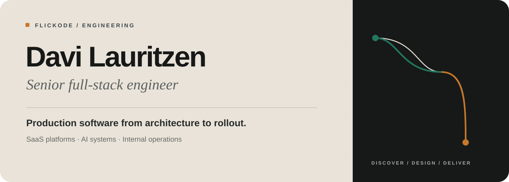
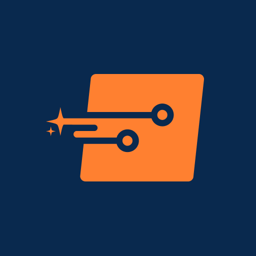
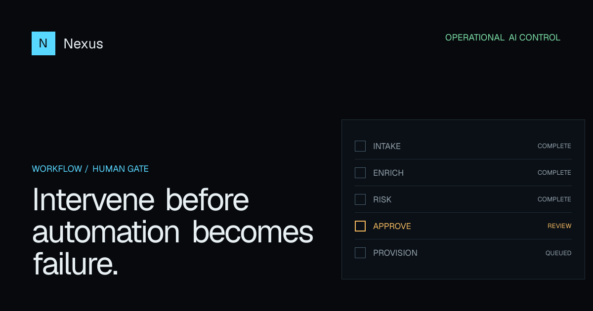
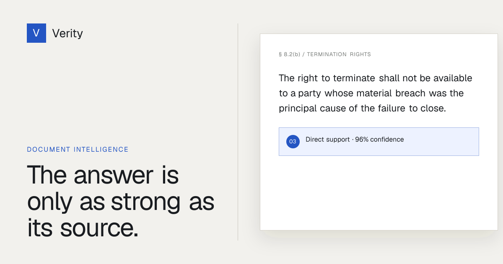
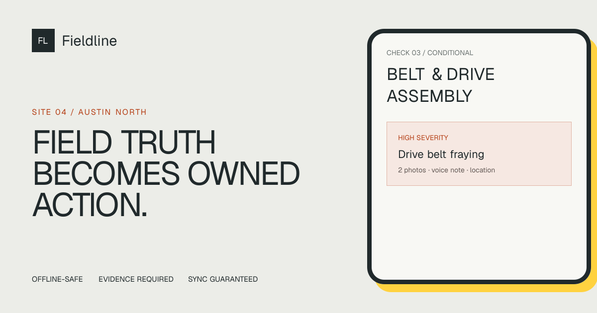
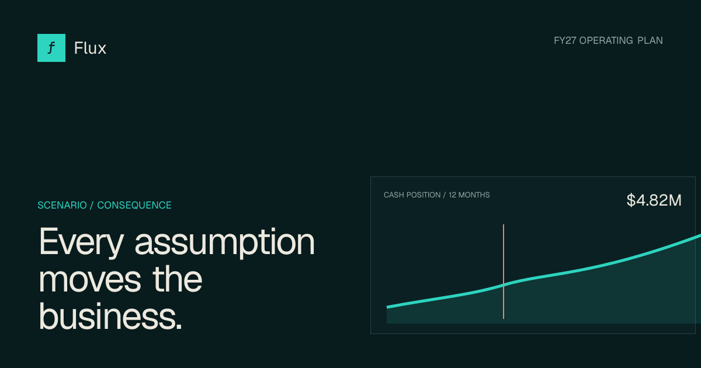
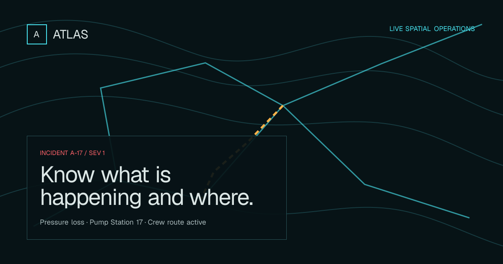

  

  <a href="https://www.flickode.com"><strong>Portfolio</strong></a>
  &nbsp;·&nbsp;
  <a href="https://www.upwork.com/freelancers/davilauritzen"><strong>Upwork</strong></a>
  &nbsp;·&nbsp;
  <a href="https://www.linkedin.com/in/davilauritzen/"><strong>LinkedIn</strong></a>
  &nbsp;·&nbsp;
  <a href="mailto:hello@flickode.com"><strong>Discuss a build</strong></a>

 

I design and build production software for teams whose operations have outgrown spreadsheets, manual handoffs, or brittle internal tooling.

My work spans **SaaS products, AI-assisted workflows, internal platforms, search systems, data-heavy backends, and third-party integrations**. I stay close to the code while also owning architecture, scope, trade-offs, and delivery.

<table>
  <tr>
    <td align="center"><strong>Top Rated Plus</strong> Upwork</td>
    <td align="center"><strong>$100K+</strong> client work</td>
    <td align="center"><strong>3,600+</strong> hours delivered</td>
    <td align="center"><strong>1.4M+</strong> users supported</td>
  </tr>
</table>

## Production experience

My background combines product-company engineering with end-to-end delivery for international clients.

<table>
  <tr>
    <td width="56" align="center">
      
    </td>
    <td>
      <strong><a href="https://www.stratifi.com">StratiFi Technologies</a></strong> 
      Customer Success Engineer · Apr 2026-present 
      Work across engineering and customer-facing teams to investigate issues, validate releases, improve product reliability, and support a smooth platform experience.
    </td>
  </tr>
  <tr>
    <td width="56" align="center">
      
    </td>
    <td>
      <strong><a href="https://www.snapmagic.com">SnapMagic</a> (formerly SnapEDA)</strong> 
      Software Engineer, GTM · Oct 2024-Apr 2026 
      Production engineering across search, data systems, monitoring, incident resolution, and customer-facing workflows for a high-traffic electronics platform.
    </td>
  </tr>
  <tr>
    <td width="56" align="center">
      
    </td>
    <td>
      <strong><a href="https://gobrunch.com">GoBrunch</a></strong> 
      Full-Stack Developer · 2023-2024 
      Shipped real-time collaboration, cloud-storage, and interaction features for an immersive virtual workspace product.
    </td>
  </tr>
  <tr>
    <td width="56" align="center">
      
    </td>
    <td>
      <strong><a href="https://www.s-fx.com">S-FX.com</a></strong> 
      API Developer · 2022-2023 
      Built PHP and SOAP integrations plus an IoT-backed operational dashboard for a US technology-services company.
    </td>
  </tr>
</table>

Alongside these roles, I have delivered SaaS platforms, internal systems, automation, and full-stack products for international clients through Upwork since 2022.

## Selected product work

Five live, interactive products built to demonstrate complete operational workflows rather than static dashboard concepts.

### Nexus

AI workflow supervision with human approvals, recoverable execution, evidence, and audit history. 
**[Explore the live product →](https://nexus.flickode.com)**

### Verity

Document intelligence for reviewable answers, exact citations, evidence inspection, and governed decisions. 
**[Explore the live product →](https://verity.flickode.com)**

### Fieldline

Offline-safe field inspections with evidence capture, remediation, conflict handling, and operational reporting. 
**[Explore the live product →](https://fieldline.flickode.com)**

### Flux

Scenario planning that connects assumptions to runway, cash, margin, hiring capacity, and board-ready narrative. 
**[Explore the live product →](https://flux.flickode.com)**

### Atlas

An interactive spatial command surface for utility networks, field incidents, telemetry, routes, and coordinated response. 
**[Explore the live product →](https://atlas.flickode.com)**

These are independently created portfolio products with fictional organizations and data. They do not imply client commissions or fabricated business outcomes.

## What I build

- **Product platforms:** SaaS products, internal tools, CRM, operational systems, dashboards, and client portals.
- **AI, search and data:** LLM workflows, semantic search, Elasticsearch, data pipelines, analytics, and reporting.
- **Delivery systems:** APIs, integrations, background jobs, cloud deployments, and production modernization.

`React` · `Next.js` · `TypeScript` · `Python` · `Django` · `FastAPI` · `PostgreSQL` · `Supabase` · `Elasticsearch` · `BigQuery` · `Redis` · `Docker`

## Engineering principles

- **Operational truth over decoration.** Important actions work, persist, recover, and explain their state.
- **Architecture proportional to the product.** Clear boundaries without unnecessary ceremony.
- **Production includes the unhappy paths.** Loading, validation, empty, conflict, offline, error, and recovery states matter.

## Selected production outcomes

- Improved search quality through Elasticsearch retrieval, cross-encoder reranking, benchmark design, and regression validation.
- Migrated and optimized more than 100 analytics queries while creating a more reliable reporting source of truth.
- Automated a recurring reporting workflow that previously required hours of manual preparation.
- Built and maintained full-stack systems across search, data, operations, CRM, finance, and workflow automation.

## Work with me

Planning a SaaS product, internal platform, AI workflow, or complex modernization?

I work with founders and product teams on carefully scoped builds, technical discovery, and production delivery.

**[Tell me what you want to build](mailto:hello@flickode.com?subject=Project%20inquiry%20from%20GitHub)** 
[Flickode](https://www.flickode.com) · [Upwork](https://www.upwork.com/freelancers/davilauritzen) · [LinkedIn](https://www.linkedin.com/in/davilauritzen/)
